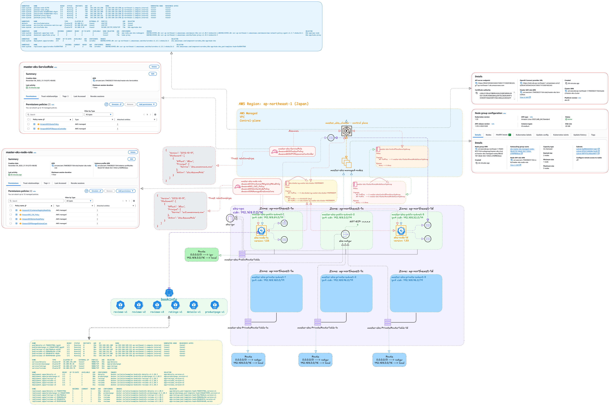

# EKS Terraform — quickstart, reference & architecture

This Terraform project provisions an AWS EKS cluster with a managed node group and all supporting networking and IAM. It recreates the structure of the provided CloudFormation template but uses Terraform for repeatable creation and management.

## Architecture flow (high level)



```bash
flowchart TB
  subgraph VPC[Dedicated VPC]
    direction TB
    IGW[Internet Gateway]
    NAT[NAT Gateway]
    PublicSubnets[Public Subnets (3 AZs)]
    PrivateSubnets[Private Subnets (3 AZs)]
    RTPublic[Public Route Table]
    RTPrivate[Private Route Tables]
  end

  subgraph EKS[EKS Control Plane]
    direction TB
    CP[aws_eks_cluster (control plane)]
    CPSG[Control Plane SG]
  end

  subgraph Nodes[Managed Node Group]
    direction TB
    NG[aws_eks_node_group]
    NodeSG[Node Security Group]
    NodeRole[Node IAM Role]
  end

  subgraph IAM[IAM & OIDC]
    OIDC[aws_iam_openid_connect_provider]
    ControlPlaneRole[Control Plane Role]
  end

  VPC --> IGW
  VPC --> NAT
  VPC --> PublicSubnets
  VPC --> PrivateSubnets
  PublicSubnets --> RTPublic
  PrivateSubnets --> RTPrivate

  CP --> CPSG
  CPSG --> RTPrivate
  NG --> NodeSG
  NG --> NodeRole
  NodeSG --> RTPrivate

  CP -->|uses| ControlPlaneRole
  NG -->|registers nodes with| CP
  NG -->|assumes| NodeRole
  CP -->|exposes issuer| OIDC
  OIDC -->|used by| IAM
```

The diagram shows the VPC and networking resources (IGW, NAT, public/private subnets and route tables), the EKS control plane and its security group, the managed node group and its IAM role & security group, and the OIDC provider used for IRSA.

## Project Structure
```bash
├── AWS_EKS_By_Terraform.png
├── eks_cluster.tf
├── eks_vpc.tf
├── irsa.tf
├── node_group.tf
├── outputs.tf
├── providers.tf
├── README.md
├── terraform.tfvars
└── variables.tf
```

## Files
- `eks_cluster.tf` — EKS cluster resource and control-plane configuration (role, version, vpc_config)
- `eks_vpc.tf` — VPC, public/private subnets, IGW, NAT, route tables and networking
- `irsa.tf` — creates IAM OIDC provider to enable IRSA (IAM Roles for Service Accounts)
- `node_group.tf` — node IAM role, policy attachments and `aws_eks_node_group` (managed)
- `outputs.tf` — exported IDs/ARNs and node group information
- `providers.tf` — Terraform provider configuration (AWS provider, region, profile)
- `variables.tf` — configurable inputs and defaults
- `terraform.tfvars` — (optional) environment-specific variable values used during `terraform apply`
- `README.md` — this file (project quickstart, diagram, and notes)

## Prerequisites
- Terraform 1.0+ (recommended 1.4+)
- AWS CLI configured with credentials/profiles that have permissions for IAM, EC2, EKS, S3 (if used), etc.
- `kubectl` and `aws-iam-authenticator`/`aws` CLI available for testing after deploy

## Key variables (summary)
- `prefix` — name prefix used for resource names
- `eks_cluster_name` — EKS cluster name
- `eks_vpc_cidr` / `eks_public_subnet_cidrs` / `eks_private_subnet_cidrs` — network CIDRs
- `node_group_desired_capacity`, `node_group_min_size`, `node_group_max_size` — node scaling
- `node_instance_type` — instance type for nodes (default `t3.medium`)
- `node_capacity_type` — `ON_DEMAND` or `SPOT`
- `enable_ssm` — attach `AmazonSSMManagedInstanceCore` to node role
- `node_group_name` — optional explicit node group name (fall back: `${var.prefix}-managed-nodes`)
- `eks_version` — Kubernetes control plane version

For full variable list and descriptions, see `variables.tf`.

## Quick start
1. Edit `variables.tf` or create `terraform.tfvars` for environment-specific values.

2. Initialize and validate:

```bash
cd /home/michale/eks-deploy-project/terraform
terraform init
terraform validate
```

3. Plan and apply:

```bash
terraform plan -out=tfplan
terraform apply tfplan
```
### Output Results
```bash
Apply complete! Resources: 40 added, 0 changed, 0 destroyed.

Outputs:

ARN = "arn:aws:eks:ap-northeast-1:794038231164:cluster/master-eks-cluster"
CertificateAuthorityData = "LS0tLS1CRUdJTiBDRVJUSUZJQ0FURS0tLS0tCk1JSURCVENDQWUyZ0F3SUJBZ0lJWW1tOVNHM1NBeEl3RFFZSktvWklodmNOQVFFTEJRQXdGVEVUTUJFR0ExVUUKQXhNS2EzVmlaWEp1WlhSbGN6QWVGdzB5TlRFeE1EUXhNekl3TWpaYUZ3MHpOVEV4TURJeE16STFNalphTUJVeApFekFSQmdOVkJBTVRDbXQxWW1WeWJtVjBaWE13Z2dFaU1BMEdDU3FHU0liM0RRRUJBUVVBQTRJQkR3QXdnZ0VLCkFvSUJBUUMzNk5YUi9XSkxJYU5OUDNDQ2N6YUduTGFCd3E5cGx2NmxSTU5UVHdWUzFQQ2lBSzE5czlPYy8vQVcKeExFdURsU2taeEpJaGJ3VVZDdnVqSjM2dlY3dFFXcHVLbTc0R2JZYjhxRVUrL3dYUk1wNE55bEpSRlFYdGRpMApUa3ltU2NiNnJpMEg3cjF1QXdZODBselBWS1pWNFQvcVdyZ05jSTdZNlk2eUpmb0ZlSGVOeno2aEdXV2NVd1FyCkIvTmRIMGhnY3cwU0R2TW1xMzA3a3hDWkFWRDUxV2grM0hkMHV5c3laRVpsY3g5ZnRiN1NPK3RONkowazVFcm0KY29DV0I3cEJ6U2oyZkswT1Q2VmJVaS94cWxmSUZiWDNqR0hqallCcXEyRWh3M3V5TFJIWml2eXlVa001c2I4dwp1VUR4UjJSUTlBZ1FXRTlIVmNwVVhDN21JQTh6QWdNQkFBR2pXVEJYTUE0R0ExVWREd0VCL3dRRUF3SUNwREFQCkJnTlZIUk1CQWY4RUJUQURBUUgvTUIwR0ExVWREZ1FXQkJTUzJKZkpYQ3FIUkFvR0t5OFdCR0d5ZThZcFdUQVYKQmdOVkhSRUVEakFNZ2dwcmRXSmxjbTVsZEdWek1BMEdDU3FHU0liM0RRRUJDd1VBQTRJQkFRQmNPdG9VUjE0QgorMThIeXF3T09FQmM4VHpBSExNemd5U3VDYzlkVFh5U05SV0dUTlh0YW1wZXd4c1lYMUVQRnFCT0piTEJlY3BhCnJvUnRMSWdpM2k1dHJBVjBxT0FVOGhFNkM1TTc5b241ZmN0b2U1ZGQ3dTJzK0Noa1BYcTN2UnRJcWNNQVN4TlkKdy9paG9zTUZ1Vml5UFl3OG9MdTZQZmRrSWVqMFRLc0lTMHRzVU50YzZvMitITDN5NU91YTg5c3lkY3JoV0pscgozSXBnQ29OODNjTXN5Mkx2YnZhdmYwRW5MejlhYjJ6bUY5cHJ2cURZMDlYVllUVndTWGRja1lUSWwvdSt4SlZ2CjFZK1MraTAxRlBsV2s0VDBnQithUU80MU95K2NTdWdmTDVSbGl6eWxqOXhXU0tjREI0Sm1GS1QrbGdoVVRzZmcKdDZVUnN3QVZJQ1EzCi0tLS0tRU5EIENFUlRJRklDQVRFLS0tLS0K"
ClusterSecurityGroupId = "sg-075aea401df1cad8c"
ClusterStackName = "cluster-stack"
Endpoint = "https://B5AF2059A5342A7590571F33E818D2A5.gr7.ap-northeast-1.eks.amazonaws.com"
FeatureNATMode = "Single"
NodeGroupARN = "arn:aws:eks:ap-northeast-1:794038231164:nodegroup/master-eks-cluster/master-eks-managed-nodes/98cd2787-86dd-30c7-9364-a700ff856eac"
NodeGroupName = "master-eks-managed-nodes"
NodeGroupStatus = "ACTIVE"
NodeInstanceType = "t3.medium"
NodeRoleARN = "arn:aws:iam::794038231164:role/master-eks-node-role"
NodeRoleName = "master-eks-node-role"
OIDCProviderARN = "arn:aws:iam::794038231164:oidc-provider/oidc.eks.ap-northeast-1.amazonaws.com/id/B5AF2059A5342A7590571F33E818D2A5"
SecurityGroup = "sg-075aea401df1cad8c"
ServiceRoleARN = "arn:aws:iam::794038231164:role/master-eks-ServiceRole"
SharedNodeSecurityGroup = "sg-0986e82fe50a50ff5"
SubnetsPrivate = "subnet-00f747ac45bed4871,subnet-0f5b57eb848a14a2b,subnet-0a9f8040394514ab7"
SubnetsPublic = "subnet-09017fdd6cbb24168,subnet-008492e9b2843a9b3,subnet-047f0ca9b6c3b07ab"
VPC = "vpc-0844e5b714c7f0aba"
```


4. After apply, update kubeconfig and verify:

```bash
aws eks update-kubeconfig --name $(terraform output -raw ARN | awk -F/ '{print $2}') --region <region> --profile <profile>
kubectl get nodes
NAME                                                 STATUS   ROLES    AGE     VERSION
ip-192-168-132-250.ap-northeast-1.compute.internal   Ready    <none>   4m29s   v1.33.5-eks-113cf36
ip-192-168-165-121.ap-northeast-1.compute.internal   Ready    <none>   4m28s   v1.33.5-eks-113cf36
####################################################################################################################################
kubectl get pods -A
NAMESPACE     NAME                       READY   STATUS    RESTARTS   AGE
kube-system   aws-node-6l79f             2/2     Running   0          5m3s
kube-system   aws-node-w7kgv             2/2     Running   0          5m2s
kube-system   coredns-5c658475b5-n5gth   1/1     Running   0          8m14s
kube-system   coredns-5c658475b5-rhsrz   1/1     Running   0          8m13s
kube-system   kube-proxy-5glsl           1/1     Running   0          5m2s
kube-system   kube-proxy-7tmtq           1/1     Running   0          5m3s
```

## Importing existing node groups
If you created a managed node group previously (for example with `eksctl`) and want Terraform to manage it, import it rather than re-create it:

```bash
terraform import aws_eks_node_group.managed_nodes <cluster-name>:<nodegroup-name>
```

Alternatively set `var.node_group_name` to a different name to avoid collisions.

## IRSA (OIDC) notes
- Terraform creates an IAM OIDC provider for the EKS cluster and exports its ARN as `OIDCProviderARN`.
- Use the OIDC provider to create IAM roles that can be assumed by Kubernetes service accounts (IRSA) for fine-grained pod permissions.

## Outputs (selected)
- `ARN` — cluster ARN
- `Endpoint` — cluster API endpoint
- `CertificateAuthorityData` — base64 CA data
- `ClusterSecurityGroupId`, `SecurityGroup` — control plane SG id
- `ServiceRoleARN` — control plane IAM role
- `SubnetsPrivate`, `SubnetsPublic`, `VPC` — networking ids
- `NodeGroupName`, `NodeGroupARN`, `NodeGroupStatus` — managed node group info
- `NodeRoleARN`, `NodeRoleName`, `NodeInstanceType` — node role info
- `OIDCProviderARN` — OIDC provider ARN (for IRSA)

## Troubleshooting
- "Resource already exists": there's a collision with resources created outside Terraform (eksctl/CloudFormation). Import or delete the external resource.
- OIDC thumbprint lookup fails: if `data.tls_certificate` cannot access the issuer URL, fetch the issuer thumbprint manually and add it to the provider resource.
- Node group creation fails due to name collision: change `var.node_group_name` or import the existing node group.

## Next steps (suggested)
- Add a `node_group_name` example value to `variables.tf` if you want to control naming explicitly.
- Move node-group resources into a reusable module for multiple nodegroups.
- Add a Launch Template for custom AMIs or bootstrap user-data.
- Convert node group to use Spot by setting `node_capacity_type = "SPOT"`.
- Add IRSA role & service-account examples (I can add a ready-to-apply snippet).

If you'd like me to add any of the suggested improvements (import helper, IRSA example, launch template), tell me which and I'll implement it.

Quick start
1. Review and adjust variables in `variables.tf` or create a `terraform.tfvars` file in this folder.

2. Initialize Terraform and validate:

```bash
cd eks-deploy-project/terraform
terraform init
terraform validate
```

3. Plan and apply:

```bash
terraform plan -out=tfplan
# Inspect tfplan, then apply
terraform apply --auto-approve
```

What this creates
- VPC with 3 public and 3 private subnets (AZ-aware)
- Internet Gateway and a NAT Gateway
- Public and private route tables with associations
- Security groups used for control plane and nodes
- IAM role for the EKS control plane
- `aws_eks_cluster` (control plane)
- IAM role for node group and policy attachments
- `aws_eks_node_group` (managed) — default: t3.medium, desired 3, min 2, max 4

Key variables (see `variables.tf`)
- `prefix` — name prefix used for resource names
- `eks_cluster_name` — EKS cluster name
- `eks_vpc_cidr`, `eks_public_subnet_cidrs`, `eks_private_subnet_cidrs` — network CIDRs
- `node_group_desired_capacity`, `node_group_min_size`, `node_group_max_size` — node scaling config
- `node_instance_type` — instance type for nodes (default `t3.medium`)
- `node_capacity_type` — `ON_DEMAND` or `SPOT`
- `enable_ssm` — if true, attaches `AmazonSSMManagedInstanceCore` to the node role

Notes and gotchas
- This Terraform config creates the EKS control plane and a managed node group. If you already created a managed node group with `eksctl` or another tool using the same cluster and the same node group name, Terraform `apply` will fail because the resource already exists. Options:
  - Use a different node group name by changing `var.prefix` or by me adding a dedicated `node_group_name` variable.
  - Import the existing node group into Terraform state:

    ```bash
    # Example (replace placeholders):
    terraform import aws_eks_node_group.managed_nodes <cluster-name>:<nodegroup-name>
    ```
  
  - (Optional) Add a `node_group_name` variable to control the managed node group name explicitly — I can add that for you.
  - To override the node group name, set `var.node_group_name` (defaults to `${var.prefix}-managed-nodes`).
  - The Terraform configuration also creates an IAM OIDC provider so you can use IRSA (IAM Roles for Service Accounts). The OIDC provider ARN is exported as the `OIDCProviderARN` output.
    ```

  - Delete the existing node group (if safe) and let Terraform create it.

- The node role created here attaches common managed policies sufficient for typical managed node groups. If you have a more restrictive policy model, adjust the attachments in `node_group.tf`.

- If you previously created resources with `eksctl` or CloudFormation in the same AWS account/region, check for resource name collisions (VPC, subnets, IGW, NAT, nodegroup names). Importing existing resources into Terraform is possible but requires the exact ARN/resource id.

Outputs
- `ARN` — cluster ARN
- `CertificateAuthorityData` — base64 CA data for kubeconfig
- `Endpoint` — cluster API endpoint
- `ClusterSecurityGroupId`, `SecurityGroup` — control plane security group id
- `ServiceRoleARN` — control plane IAM role ARN
- `SharedNodeSecurityGroup` — shared node SG id
- `SubnetsPrivate`, `SubnetsPublic`, `VPC` — networking ids
- `NodeGroupName`, `NodeGroupARN`, `NodeGroupStatus` — managed node group details
- `NodeRoleARN`, `NodeRoleName`, `NodeInstanceType` — node role and instance type

Good-to-have next steps
- (Optional) Add a `node_group_name` variable to control the managed node group name explicitly — I can add that for you.
- (Optional) Move the node-group resources into a reusable module if you plan to deploy multiple node groups with different sizes or instance types.
- (Optional) Enable node-group IAM OIDC provider and attach IRSA policies to allow pods to assume fine-grained permissions — I can add that if you need pod-level AWS permissions.

If you want, I can:
- Add `node_group_name` as a variable and update the files accordingly.
- Provide an import helper command if you already created node groups with `eksctl` (tell me the cluster and nodegroup names).
- Convert the node group to use Spot instances or a Launch Template.

Tell me which of the optional items you'd like next and I will apply the changes.